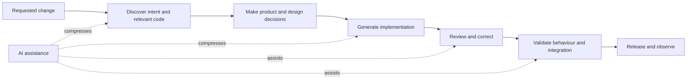
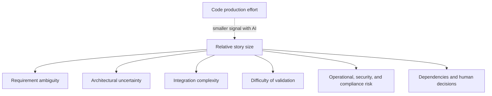
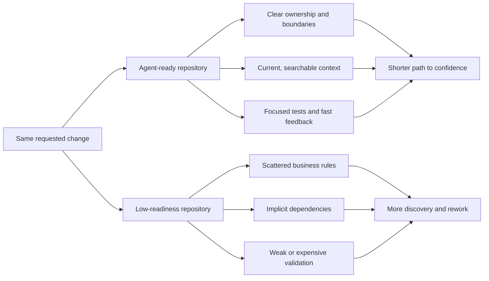
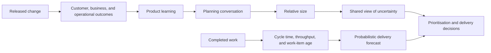

Coding agents can turn a well-understood change into working code in minutes. They can also spend an afternoon exploring the wrong part of a repository, reproduce an existing abstraction under a new name, or produce an implementation that looks complete until somebody tries to verify it.

That variability raises an obvious question for teams that use story points: if AI changes how quickly code can be produced, do points still mean anything?

They can, but only if the team is clear about what it is estimating.

Story points were never a reliable measure of how many hours somebody would spend typing code. At their best, they give a team a relative language for discussing complexity, effort, and uncertainty. At their worst, they become a disguised deadline, a productivity score, or a way to compare teams whose scales have nothing in common.

AI makes that distinction harder to ignore. Code generation is becoming cheaper. Understanding the change, fitting it into the system, and establishing that it is safe remain expensive.

## AI changes where the work happens

In a conventional development task, implementation may occupy a visible share of the elapsed time. A developer explores the code, makes design decisions, writes the change, tests it, and responds to review.

An agent can compress parts of implementation. It can generate a controller, write a mapping function, update a group of call sites, or produce a first set of tests much faster than a person working line by line.

The rest of the delivery system does not automatically become faster with it.

*AI can compress individual activities, but the change still has to pass through the complete delivery system.*

Sometimes the work disappears. A routine mechanical change may genuinely become smaller from beginning to end. Sometimes the work moves. Time saved during generation is spent reviewing a larger diff, correcting an assumption, strengthening tests, or investigating an unexpected interaction.

This is why estimating only the apparent coding effort becomes less useful in an AI-driven workflow. The amount of code is a weak signal for the amount of work required to deliver it confidently.

## Story points should describe the delivery problem

Consider a request to add a cancellation reason to an order.

The visible implementation might be small: add a field, update an endpoint, persist the value, and display it. An agent could generate those edits quickly. But the delivery problem may include questions that are not visible in the request:

- Can every order be cancelled, or only orders in particular states?
- Is the reason free text, a controlled value, or both?
- Does changing the database require a staged migration?
- Must the value appear in events, reports, and support tools?
- Does it contain personal or sensitive information?
- Which existing clients will encounter the new contract?
- What evidence is required before the team can release it?

Those questions determine the size of the work more than the time needed to generate the first implementation.

*In an AI-driven team, story size is more useful as a view of unresolved delivery uncertainty than as a view of typing effort.*

This does not require a new point scale. It requires a better estimation conversation.

When one person sees a two and another sees an eight, the useful outcome is not the average. It is discovering that one person assumed a backward-compatible schema change while another expects a coordinated client migration. AI may help execute either approach, but it cannot remove a decision the team has not made.

## The same story can have different AI leverage

AI does not provide a fixed productivity multiplier. Its effectiveness depends on the environment in which it works.

In a repository with clear package ownership, current documentation, narrow interfaces, representative tests, and fast feedback, an agent can locate the right boundary and verify a change with relatively little exploration. In a repository with duplicated rules, hidden runtime wiring, stale documentation, and slow tests, the same agent has to infer more and can prove less.

*AI leverage is a property of the delivery environment, not only of the model.*

This creates a problem if teams quietly change the meaning of their points after adopting AI. A story that used to be five points may now take less implementation time, but assigning it two points simply because an agent writes it faster can erase the integration and validation risks that remain.

It also creates an opportunity. If similar work becomes consistently smaller because the team improved its tests, documentation, architecture, and tooling, that is real evidence that the delivery system has improved. The improvement should appear first in cycle time and predictability. The team can then recalibrate its local estimation habits if doing so helps planning.

## Do not convert AI output into velocity

The most damaging use of story points is as a productivity target. AI makes that use even easier to game.

If a team is expected to increase velocity after receiving coding agents, it can respond by completing more small tickets, splitting work differently, inflating estimates, or accepting generated changes before they are properly understood. The reported number rises even if review queues grow, defects escape, and engineers spend more time correcting work after it is counted as complete.

Lines of generated code, agent tasks completed, suggestion acceptance, and points delivered are all measures of activity. None establishes that customers received value or that the organisation can deliver changes more reliably.

Velocity also remains local to the team that created it. Two teams may use different point scales, definitions of done, repositories, models, permissions, review standards, and deployment processes. AI increases the number of variables, making cross-team comparison less meaningful rather than more.

Points should not be used to evaluate individuals either. A developer who rejects a plausible but unsafe agent-generated change may deliver fewer visible points while preventing substantially more work.

## Separate estimation, forecasting, and value

Teams often ask story points to answer three different questions:

1. How uncertain or difficult does this work appear?
2. When is a collection of work likely to be finished?
3. Was completing it worthwhile?

One number cannot answer all three.

Story points can support the first question by exposing assumptions and relative uncertainty. Historical flow data is more useful for the second. Product and operational outcomes are needed for the third.

*Estimation supports conversation, flow supports forecasting, and observed outcomes show whether the work mattered.*

For forecasting, a team can use the throughput and cycle times of completed work to answer questions such as: how likely are we to finish these items by a given date? That forecast still contains uncertainty, but it is based on how work moves through the actual system, including agent use, review, testing, dependencies, and release constraints.

For value, the team needs a measure connected to the reason for making the change. That might be successful task completion, reduced support demand, conversion, reliability, recovery time, or compliance risk retired. Delivering eight points does not tell the team whether any of those changed.

## What should happen during estimation?

If a team keeps story points, its estimation conversation should account for how the work will be completed without trying to predict every prompt or tool call.

Useful questions include:

- Is the desired behaviour clear enough to verify?
- Is there an established pattern the agent can follow?
- Which system boundaries and integrations will change?
- Can the relevant behaviour be tested in isolation?
- How much generated code will require specialist review?
- Are there migrations, rollout constraints, or irreversible decisions?
- Does the task depend on information or approval outside the team?
- What would make us confident enough to release it?

The answers may reveal that the work should be split. A discovery item can resolve an unknown contract before implementation. A migration can be separated from its product use. A broad change can be divided into independently releasable slices.

That is more valuable than debating whether the final number is five or eight. The purpose of estimation is to improve the team's understanding and choices before work begins.

## A practical way to evolve story points

Teams do not need to remove story points immediately to adapt to AI-driven development. They can make a few deliberate changes.

First, stop using velocity as a target or a comparison between teams. A relative, local planning tool should not become an organisational productivity score.

Second, define points around the complete path to done. Generated code has no special status. Review, correction, testing, integration, deployment, and required decisions are part of the story.

Third, use estimation disagreements to uncover assumptions. Record important unknowns or split the work rather than negotiating the number until everybody appears to agree.

Fourth, use flow metrics for forecasting. Track cycle time, throughput, work-item age, blocked time, and review time. Watch whether AI reduces elapsed delivery time or merely moves the queue.

Fifth, inspect quality and rework. Escaped defects, reopened items, rollback rates, and follow-up corrections help show whether apparent speed is sustainable.

Finally, connect released work to an outcome. That keeps both points and AI output subordinate to the reason the work exists.

## The value that remains

Story points still have value in AI-driven development when they make uncertainty discussable.

They can help a team notice that a small code change crosses a dangerous boundary, that an apparently large change follows a safe mechanical pattern, or that the main obstacle is a product decision rather than implementation. They can create the conversation in which assumptions become visible before an agent turns them into code.

They lose that value when they are treated as hours, output, performance, or proof of an AI investment.

The better question is no longer, "How much effort will it take us to write this code?" It is, "How much uncertainty must we resolve before we can confidently deliver this change?"

In AI-driven development, producing code is increasingly cheap. Establishing that it is the right code, in the right place, with acceptable consequences remains the expensive part.
