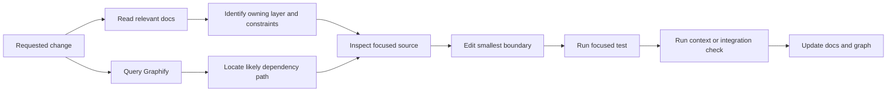

Clean Architecture helps coding agents when it gives each kind of change an expected home, limits the dependencies available from that home, and provides focused tests for verification. But package structure alone cannot explain every decision, exception, runtime path, or workflow.

This is Part 2 of a two-part series. [Part 1](/writing/how-clean-architecture-makes-coding-agents-faster-and-more-effective/) uses Kotlin and Spring to show how source-code boundaries narrow discovery, implementation, and testing. This part turns those boundaries into operating instructions an agent can find, maintain, and verify.

The goal is not more documentation. It is a short path from task language to the owning code, the relevant constraints, and the right proof.

## docs/ turns structure into operating instructions

Package names show where code lives. They do not explain every decision. A small docs/ directory should fill that gap:

```text
docs/
├── ARCHITECTURE.md
├── DEPENDENCY_INJECTION.md
├── WORKFLOWS.md
├── PERSISTENCE.md
├── TESTING.md
├── requirements/
└── decisions/
```

*Each document answers a distinct question instead of repeating the source code.*

ARCHITECTURE.md should define package responsibilities and inward dependency rules. DEPENDENCY_INJECTION.md should explain bean ownership, qualifiers, profiles, and composition roots. WORKFLOWS.md should cover multi-step operations and transaction boundaries. TESTING.md should map each change type to its focused and integration checks.

The best rules are concrete:

- Domain packages cannot import Spring.
- Application ports are owned by the application layer.
- JPA records cannot leave the persistence adapter.
- Use cases are plain Kotlin and use constructor injection.
- Configuration classes own application bean composition.
- Controllers depend on inbound ports, not concrete services.

This documentation improves agent speed because it prevents repeated archaeology. It improves effectiveness because the agent can compare a proposed edit against rules the team has actually chosen.

## Structure ARCHITECTURE.md for finding, not reading

An ARCHITECTURE.md file should help an agent find the next source file. It should not require the agent to read a long design essay before learning where order confirmation lives.

I would treat it as a routing document. Put the information used during discovery near the top, keep headings stable, and link every architectural claim to concrete packages, composition roots, tests, or deeper documents.

A useful structure looks like this:

```markdown
---
status: current
owners: [orders-team]
last_verified: 2026-07-18
applies_to: src/main/kotlin/com/example/orders
---

# Orders Architecture

## Start here

| If the task changes... | Start in... | Verify with... |
|---|---|---|
| an order invariant | domain/model | domain/model tests |
| workflow sequencing | application/service | use-case tests |
| HTTP input or output | adapter/in/http | controller tests |
| storage or mapping | adapter/out/persistence | repository tests |
| bean selection or wiring | config | context tests |

## Package map

- domain/ - business state and invariants; no Spring imports
- application/port/in/ - operations exposed by the application
- application/port/out/ - capabilities required by use cases
- application/service/ - workflow orchestration
- adapter/in/ - transport-specific input and output
- adapter/out/ - persistence and external system implementations
- config/ - Spring composition roots

## Dependency rules

Allowed:
adapter -> application -> domain
config -> all layers for composition only

Forbidden:
domain -> Spring, application, or adapters
application -> adapters, HTTP, JPA, or Spring Data
controller -> concrete persistence adapter

Enforced by: OrderArchitectureTest

## Runtime path

ConfirmOrderController
  -> ConfirmOrderUseCase
  -> ConfirmOrderService
  -> OrderRepository
  -> JpaOrderRepository

Composition root: config/OrderModule.kt

## Main workflows

- Confirm order: WORKFLOWS.md#confirm-order
- Cancel order: WORKFLOWS.md#cancel-order

## External boundaries

- HTTP contract: API.md#orders
- Persistence mapping: PERSISTENCE.md#orders
- Events published: EVENTS.md#order-events

## Test ownership

- Domain behaviour: OrderTest
- Use-case decisions: ConfirmOrderServiceTest
- HTTP mapping: ConfirmOrderControllerTest
- JPA mapping: JpaOrderRepositoryTest
- DI wiring: OrderModuleTest

## Decisions and exceptions

- ADR-004: explicit @Configuration for application services
- Exception: legacy import adapter bypasses the inbound port;
  removal tracked in issue ARCH-112
```

*A routing-first ARCHITECTURE.md lets an agent move from task language to package, runtime path, and proof without searching the whole repository.*

The first table is the most important part. Agents usually arrive with task language, not package names. Mapping “changes an invariant” or “changes persistence mapping” to a starting directory converts the request into a search plan immediately.

The package map should say what each area owns and what it must not contain. A directory list without responsibility statements still leaves the agent guessing between nearby layers.

Dependency rules should be directional and include forbidden examples. “We use Clean Architecture” is not actionable. “application cannot import adapter, HTTP, JPA, or Spring Data packages” is something an agent can check before editing and something an architecture test can enforce.

The runtime path should name real symbols. This gives an agent a short trace through DI: controller, inbound port, use-case implementation, outbound port, concrete adapter, and composition root. Keep it to the common path and link complex branches to WORKFLOWS.md.

Test ownership belongs in the same document because finding the implementation without finding its proof only solves half the task.

A few conventions make the file easier for both agents and people to search:

- Use exact package, class, and file names rather than descriptions such as “the service layer.”
- Keep one stable heading for each concern so agents can retrieve a section directly.
- Put the task-routing table and package map before background or rationale.
- Link to deeper workflow, persistence, API, and decision documents instead of copying them.
- Mark exceptions explicitly so an agent does not copy a known compromise as the preferred pattern.
- Include owners, scope, status, and last-verified metadata so stale guidance is visible.
- Use relative links and paths that repository tools can resolve.

For a large monorepo, I would not create one enormous root architecture file. The root document should explain workspace and dependency boundaries, then link to scoped ARCHITECTURE.md files for each application or domain. The nearest document should contain the concrete package map and runtime paths.

This hierarchy also helps context control. An agent can read the root routing table, follow one link, and stop once it reaches the owning boundary instead of loading architecture material for unrelated systems.

The file should describe the normal path, not every class. Graphify and source search are better for exhaustive relationships. ARCHITECTURE.md should provide the stable vocabulary and landmarks that make those searches precise.

## Update docs during the task with a skill

Documentation stays useful when updating it is part of the agent workflow rather than a cleanup task somebody remembers later.

I would package that workflow as a small documentation skill. The agent can load it after implementing and validating a change, inspect the diff, and update only the documents affected by the new behaviour or architecture.

The timing matters. Updating docs before the implementation settles can record an idea that never shipped. Updating them weeks later creates drift. Running the skill in the same task, after focused tests pass, keeps the explanation close to the evidence.

A simple skill could look like this:

```markdown
---
name: update-documentation
description: Keep repository docs aligned with validated code changes.
---

# Update Documentation

1. Inspect the current diff and identify changed behaviour, boundaries,
   commands, configuration, persistence, and assumptions.
2. Read the nearest relevant documents under docs/.
3. Compare their claims with the changed source, types, schemas, and tests.
4. Update only documents affected by the change:
   - architecture or DI rules -> docs/ARCHITECTURE.md
   - workflow or transaction order -> docs/WORKFLOWS.md
   - persistence mapping -> docs/PERSISTENCE.md
   - validation commands -> docs/TESTING.md
   - durable design choice -> docs/decisions/
5. Preserve useful rationale; remove claims that are no longer true.
6. Validate links, commands, and Mermaid diagrams.
7. Report any conflict that cannot be resolved from the repository.

Do not treat docs as runtime truth. Do not invent intent when code and
requirements disagree. Ask for a decision instead.
```

*A focused skill turns documentation maintenance into a repeatable part of completing a change.*

The skill should not rewrite the whole documentation tree on every task. It should use the architecture to calculate documentation impact in the same way the agent calculates test impact.

- A domain invariant may need a requirements or workflow update.
- A new port or adapter may change ARCHITECTURE.md or PERSISTENCE.md.
- A new bean qualifier or profile may change DEPENDENCY_INJECTION.md.
- A changed test command belongs in TESTING.md.
- A local refactor with no behavioural or architectural effect may need no docs change at all.

This improves speed on later tasks because agents no longer have to rediscover the same rationale from commit history and scattered code. It improves effectiveness because the next agent receives both the current package structure and the decisions behind it.

The skill also needs a stop condition. If source, tests, requirements, and docs disagree about intended behaviour, the agent should surface the conflict instead of choosing a story and making every file agree with its guess.

Agent instructions can make this automatic: after code validation, run the documentation-impact skill; after documentation changes, refresh the generated graph. That creates a small feedback loop in which code, tests, curated context, and generated context move together.

## Graphify narrows discovery further

The package tree and docs describe the intended architecture. Graphify can generate a persistent graph from the code and documentation to show how the repository is connected now.

For a Spring application, that graph can help an agent locate controllers, use-case interfaces, service implementations, repository ports, adapters, configuration, and high-impact shared modules before opening every file.

It can also reveal drift. If the architecture says controllers depend only on inbound ports but the graph shows a direct controller-to-persistence relationship, the agent has a specific inconsistency to inspect.

Graphify should remain a navigation aid. Reflection, conditional beans, profiles, and framework-generated implementations mean a static graph can be incomplete. Extracted relationships are evidence; inferred relationships are leads. The agent still needs to inspect source and run the Spring context.



*Curated docs explain intent; Graphify narrows the search; focused tests and the Spring context provide proof.*

## Make the dependency rules executable

Documentation and package layout are useful, but an agent can still add the wrong import.

Architecture tests with Konsist or ArchUnit can assert that domain packages do not depend on Spring, application packages do not depend on adapters, and persistence records stay inside the outbound adapter. Spring context tests can catch missing, duplicate, or ambiguous beans.

These checks turn review comments into immediate feedback. The agent can detect an architectural mistake in the same loop as a type error instead of waiting for a person to notice it.

## Complete the feedback loop

The practical gain comes from combining four kinds of context:

- Source boundaries narrow where an agent should look and edit.
- Curated documentation records ownership, intent, and exceptions.
- Generated graphs reveal current relationships and possible drift.
- Focused tests and architecture checks provide executable proof.

None of these should pretend to be the whole truth. Documentation can become stale, static graphs can miss runtime behaviour, and a narrow test can omit an integration problem. Used together, they let an agent compare intent, implementation, structure, and behaviour without loading the entire repository.

That is how Clean Architecture makes coding agents faster and more effective. It does not improve the model itself. It improves the environment around the model and keeps that environment useful as the system changes.

[Return to Part 1: source-code boundaries, dependency injection, adapters, and focused tests.](/writing/how-clean-architecture-makes-coding-agents-faster-and-more-effective/)
