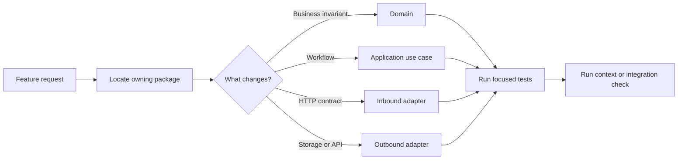
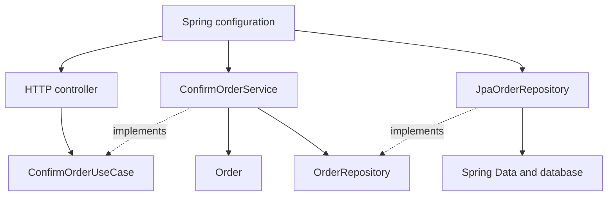

Coding agents do not usually lose time because they cannot write a function. They lose time working out where the function belongs, which version of a rule is authoritative, what else the change might affect, and which tests are enough to prove it works.

This is Part 1 of a two-part series. It focuses on the source-code boundaries that make an agent's path through a repository predictable. [Part 2](/writing/how-clean-architecture-makes-coding-agents-faster-and-more-effective-part-2/) covers the documentation and tooling that preserve those boundaries as the codebase changes.

A loosely structured repository makes every task start with a wide search. Business logic may sit in controllers, persistence models, event handlers, and utilities. The agent has to inspect all of them before it can make a reasonable guess.

Clean Architecture improves that situation by reducing the number of reasonable guesses.

It gives each kind of change an expected home, limits the dependencies available from that home, and gives tests the same shape as the production code. That can make agents faster because they read and edit fewer files. It can make them more effective because they are more likely to change the right boundary and verify the right behaviour.

Kotlin and Spring are useful for showing this in practice. Kotlin gives us explicit types and interfaces. Spring provides dependency injection and runtime composition. The architecture, rather than the framework, is what makes the agent workflow predictable.

## What faster and more effective actually means

I am not claiming that adding layers makes a model reason faster. The improvement is in the work around the model.

For a coding task, an agent normally has to do four things:

- Discover the relevant code and documentation.
- Decide which component owns the change.
- Implement it without breaking unrelated behaviour.
- Find enough evidence to say the work is complete.

Clean Architecture can shorten each step.

A stable package layout narrows discovery. Dependency direction narrows the valid implementation choices. Ports isolate external details. Focused tests narrow verification. When those constraints are missing, the agent compensates with broader searches, larger context, more speculative edits, and more rework after review.



*A clear boundary turns repository-wide investigation into a smaller, directed path.*

## Give the repository a package structure agents can predict

The directory tree is the first architecture document an agent reads. It should reveal the same boundaries described in the design.

For a Spring service, I would organise by business area first, then by architectural role inside it:

```text
src/
├── main/kotlin/com/example/orders/
│   ├── domain/
│   │   ├── model/
│   │   │   ├── Order.kt
│   │   │   └── OrderStatus.kt
│   │   └── exception/
│   │       └── InvalidOrderState.kt
│   ├── application/
│   │   ├── port/in/
│   │   │   └── ConfirmOrderUseCase.kt
│   │   ├── port/out/
│   │   │   └── OrderRepository.kt
│   │   └── service/
│   │       └── ConfirmOrderService.kt
│   ├── adapter/in/http/
│   │   ├── ConfirmOrderController.kt
│   │   └── OrderResponse.kt
│   ├── adapter/out/persistence/
│   │   ├── JpaOrderRepository.kt
│   │   ├── OrderRecord.kt
│   │   └── SpringOrderRecords.kt
│   └── config/
│       └── OrderModule.kt
└── test/kotlin/com/example/orders/
    ├── domain/model/OrderTest.kt
    ├── application/service/ConfirmOrderServiceTest.kt
    ├── adapter/in/http/ConfirmOrderControllerTest.kt
    ├── adapter/out/persistence/JpaOrderRepositoryTest.kt
    └── config/OrderModuleTest.kt
```

*Production and test packages mirror the same boundaries, making the next file easier to predict.*

This structure immediately answers several questions for an agent.

- A business rule belongs under domain.
- A workflow belongs under application/service.
- An interface required by a use case belongs under application/port.
- HTTP and persistence types stay in their adapters.
- Runtime wiring belongs in config.
- The nearest focused test has the same package path as the production class.

That predictability saves tool calls. The agent does not need to search the whole repository to discover where repository interfaces or controller tests happen to live.

## A business-rule change should stop in the domain

Suppose the task is: confirmed orders cannot be confirmed again.

With the package structure above, the agent can start at Order.kt. The rule can be implemented without loading Spring, HTTP, or JPA code:

```kotlin
package com.example.orders.domain.model

data class Order(
    val id: OrderId,
    val status: OrderStatus,
) {
    fun confirm(): Order {
        check(status == OrderStatus.PENDING) {
            "Only pending orders can be confirmed"
        }
        return copy(status = OrderStatus.CONFIRMED)
    }
}
```

*The invariant has one owner and can be tested without the framework.*

This improves speed because the implementation scope is one class and one test. It improves effectiveness because every caller, including future adapters and background jobs, gets the same rule.

If the rule lived only in a controller, an agent might produce a quick fix that another entry point bypasses. Clean Architecture pushes the decision to the smallest layer that can enforce it consistently.

## Use cases make workflow changes easy to locate

Now suppose the request changes the workflow: confirming an order must load it, apply the domain transition, save it, and return a result that an adapter can translate.

The inbound port describes the operation. The outbound port describes the external capability it needs. The service coordinates the two.

```kotlin
package com.example.orders.application.port.`in`

fun interface ConfirmOrderUseCase {
    fun confirm(command: ConfirmOrderCommand): ConfirmOrderResult
}

data class ConfirmOrderCommand(val orderId: OrderId)

sealed interface ConfirmOrderResult {
    data class Confirmed(val order: Order) : ConfirmOrderResult
    data object NotFound : ConfirmOrderResult
}

package com.example.orders.application.port.out

interface OrderRepository {
    fun findById(id: OrderId): Order?
    fun save(order: Order): Order
}
```

*Ports describe the workflow and its needs without introducing HTTP or persistence types.*

```kotlin
package com.example.orders.application.service

class ConfirmOrderService(
    private val orders: OrderRepository,
) : ConfirmOrderUseCase {
    override fun confirm(command: ConfirmOrderCommand): ConfirmOrderResult {
        val order = orders.findById(command.orderId)
            ?: return ConfirmOrderResult.NotFound

        return ConfirmOrderResult.Confirmed(
            orders.save(order.confirm()),
        )
    }
}
```

*Constructor injection makes the complete dependency surface visible on the class.*

An agent reading this service does not need to inspect the database schema or HTTP framework to understand the workflow. It can test the use case with an in-memory implementation of OrderRepository.

This is one of the clearest efficiency gains: external systems are removed from the reasoning path until the task actually concerns them.

## Dependency injection makes the graph executable

Spring is useful here because it connects the layers at runtime. It should not be allowed to erase them.

The persistence adapter implements the application-owned port:

```kotlin
package com.example.orders.adapter.out.persistence

@Repository
class JpaOrderRepository(
    private val records: SpringOrderRecords,
) : OrderRepository {
    override fun findById(id: OrderId): Order? =
        records.findById(id.value).orElse(null)?.toDomain()

    override fun save(order: Order): Order =
        records.save(order.toRecord()).toDomain()
}
```

*The adapter satisfies the port and owns all persistence mapping.*

The configuration class acts as an explicit composition root:

```kotlin
package com.example.orders.config

@Configuration
class OrderModule {
    @Bean
    fun confirmOrderUseCase(
        orderRepository: OrderRepository,
    ): ConfirmOrderUseCase = ConfirmOrderService(orderRepository)
}
```

*The composition root shows which concrete dependency is supplied to the application service.*

For an agent, constructor injection and explicit configuration create a traceable path. It can move from a controller to an inbound port, from the service constructor to an outbound port, and from Spring configuration to the concrete adapter.

Field injection and service locators make that path harder to follow. Broad component scanning can also hide where a bean enters the graph. The framework still works, but the repository becomes less legible.



*The runtime graph is assembled by Spring, while source dependencies point toward ports and domain code.*

## Thin adapters keep unrelated changes unrelated

The controller should translate transport input into a command and translate the result back into HTTP.

```kotlin
package com.example.orders.adapter.`in`.http

@RestController
@RequestMapping("/orders")
class ConfirmOrderController(
    private val confirmOrder: ConfirmOrderUseCase,
) {
    @PostMapping("/{id}/confirm")
    fun confirm(@PathVariable id: UUID): ResponseEntity<Any> =
        when (val result = confirmOrder.confirm(
            ConfirmOrderCommand(OrderId(id)),
        )) {
            is ConfirmOrderResult.Confirmed ->
                ResponseEntity.ok(OrderResponse.from(result.order))
            ConfirmOrderResult.NotFound ->
                ResponseEntity.notFound().build()
        }
}
```

*HTTP conversion stays in the inbound adapter; the use case remains transport-independent.*

If an agent is asked to change a status code or response shape, it can stay in the HTTP adapter. If it is asked to change confirmation behaviour, it moves inward. The package and type boundaries make that distinction hard to miss.

This reduces collateral edits. The agent is less likely to modify a use case for a presentation-only request or leak a ResponseEntity into application code.

## Focused tests shorten the proof

An agent is not finished when the code compiles. It needs a practical way to prove the change.

When tests mirror the architecture, the changed layer points to the first check:

- Domain rule: run OrderTest.
- Workflow decision: run ConfirmOrderServiceTest with a fake port.
- HTTP mapping: run ConfirmOrderControllerTest.
- JPA mapping or query: run JpaOrderRepositoryTest.
- Bean selection or module wiring: run OrderModuleTest.

The agent can run the narrow test while iterating, then expand to module or integration checks before finishing. It does not have to choose between no validation and an expensive full suite on every edit.

Effectiveness improves as well. Each test answers a different question, so a passing controller test cannot accidentally stand in for a missing domain test.

## Source structure is only the first half

Clean Architecture does add files and interfaces. If the system is tiny or the boundaries are invented mechanically, that structure can slow everyone down, including agents. It earns its cost when the repository contains real business rules, several entry points, external systems, or multiple teams changing it at once.

In that setting, source-code structure replaces an open-ended search with a directed path: find the owning feature, choose the boundary, follow the port, make the smallest change, and run the tests that belong to it.

That path still depends on agents understanding the team's intended architecture and knowing when it changes. [Part 2 explains how architecture documentation, update skills, generated graphs, and executable dependency rules provide that context.](/writing/how-clean-architecture-makes-coding-agents-faster-and-more-effective-part-2/)
