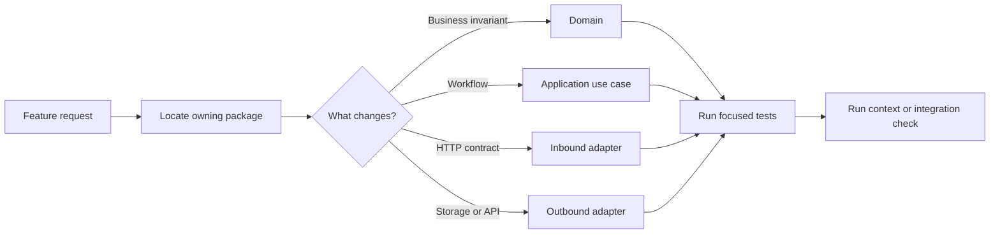
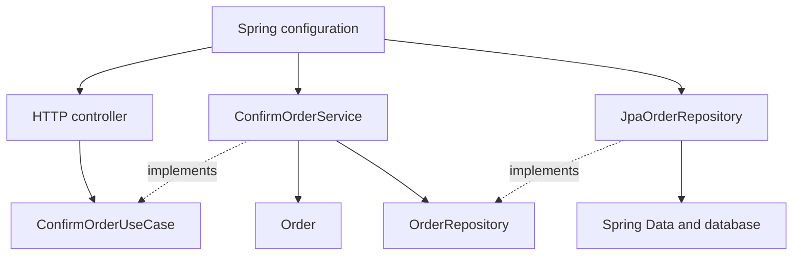
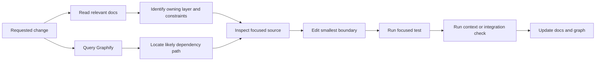

Coding agents do not usually lose time because they cannot write a function. They lose time working out where the function belongs, which version of a rule is authoritative, what else the change might affect, and which tests are enough to prove it works.

A loosely structured repository makes every task start with a wide search. Business logic may sit in controllers, persistence models, event handlers, and utilities. The agent has to inspect all of them before it can make a reasonable guess.

Clean Architecture improves that situation by reducing the number of reasonable guesses.

It gives each kind of change an expected home, limits the dependencies available from that home, and gives tests the same shape as the production code. That can make agents faster because they read and edit fewer files. It can make them more effective because they are more likely to change the right boundary and verify the right behaviour.

Kotlin and Spring are useful for showing this in practice. Kotlin gives us explicit types and interfaces. Spring provides dependency injection and runtime composition. The architecture, rather than the framework, is what makes the agent workflow predictable.

## What faster and more effective actually means

I am not claiming that adding layers makes a model reason faster. The improvement is in the work around the model.

For a coding task, an agent normally has to do four things:

- Discover the relevant code and documentation.
- Decide which component owns the change.
- Implement it without breaking unrelated behaviour.
- Find enough evidence to say the work is complete.

Clean Architecture can shorten each step.

A stable package layout narrows discovery. Dependency direction narrows the valid implementation choices. Ports isolate external details. Focused tests narrow verification. When those constraints are missing, the agent compensates with broader searches, larger context, more speculative edits, and more rework after review.



*A clear boundary turns repository-wide investigation into a smaller, directed path.*

## Give the repository a package structure agents can predict

The directory tree is the first architecture document an agent reads. It should reveal the same boundaries described in the design.

For a Spring service, I would organise by business area first, then by architectural role inside it:

```text
src/
├── main/kotlin/com/example/orders/
│   ├── domain/
│   │   ├── model/
│   │   │   ├── Order.kt
│   │   │   └── OrderStatus.kt
│   │   └── exception/
│   │       └── InvalidOrderState.kt
│   ├── application/
│   │   ├── port/in/
│   │   │   └── ConfirmOrderUseCase.kt
│   │   ├── port/out/
│   │   │   └── OrderRepository.kt
│   │   └── service/
│   │       └── ConfirmOrderService.kt
│   ├── adapter/in/http/
│   │   ├── ConfirmOrderController.kt
│   │   └── OrderResponse.kt
│   ├── adapter/out/persistence/
│   │   ├── JpaOrderRepository.kt
│   │   ├── OrderRecord.kt
│   │   └── SpringOrderRecords.kt
│   └── config/
│       └── OrderModule.kt
└── test/kotlin/com/example/orders/
    ├── domain/model/OrderTest.kt
    ├── application/service/ConfirmOrderServiceTest.kt
    ├── adapter/in/http/ConfirmOrderControllerTest.kt
    ├── adapter/out/persistence/JpaOrderRepositoryTest.kt
    └── config/OrderModuleTest.kt
```

*Production and test packages mirror the same boundaries, making the next file easier to predict.*

This structure immediately answers several questions for an agent.

- A business rule belongs under domain.
- A workflow belongs under application/service.
- An interface required by a use case belongs under application/port.
- HTTP and persistence types stay in their adapters.
- Runtime wiring belongs in config.
- The nearest focused test has the same package path as the production class.

That predictability saves tool calls. The agent does not need to search the whole repository to discover where repository interfaces or controller tests happen to live.

## A business-rule change should stop in the domain

Suppose the task is: confirmed orders cannot be confirmed again.

With the package structure above, the agent can start at Order.kt. The rule can be implemented without loading Spring, HTTP, or JPA code:

```kotlin
package com.example.orders.domain.model

data class Order(
    val id: OrderId,
    val status: OrderStatus,
) {
    fun confirm(): Order {
        check(status == OrderStatus.PENDING) {
            "Only pending orders can be confirmed"
        }
        return copy(status = OrderStatus.CONFIRMED)
    }
}
```

*The invariant has one owner and can be tested without the framework.*

This improves speed because the implementation scope is one class and one test. It improves effectiveness because every caller, including future adapters and background jobs, gets the same rule.

If the rule lived only in a controller, an agent might produce a quick fix that another entry point bypasses. Clean Architecture pushes the decision to the smallest layer that can enforce it consistently.

## Use cases make workflow changes easy to locate

Now suppose the request changes the workflow: confirming an order must load it, apply the domain transition, save it, and return a result that an adapter can translate.

The inbound port describes the operation. The outbound port describes the external capability it needs. The service coordinates the two.

```kotlin
package com.example.orders.application.port.`in`

fun interface ConfirmOrderUseCase {
    fun confirm(command: ConfirmOrderCommand): ConfirmOrderResult
}

data class ConfirmOrderCommand(val orderId: OrderId)

sealed interface ConfirmOrderResult {
    data class Confirmed(val order: Order) : ConfirmOrderResult
    data object NotFound : ConfirmOrderResult
}

package com.example.orders.application.port.out

interface OrderRepository {
    fun findById(id: OrderId): Order?
    fun save(order: Order): Order
}
```

*Ports describe the workflow and its needs without introducing HTTP or persistence types.*

```kotlin
package com.example.orders.application.service

class ConfirmOrderService(
    private val orders: OrderRepository,
) : ConfirmOrderUseCase {
    override fun confirm(command: ConfirmOrderCommand): ConfirmOrderResult {
        val order = orders.findById(command.orderId)
            ?: return ConfirmOrderResult.NotFound

        return ConfirmOrderResult.Confirmed(
            orders.save(order.confirm()),
        )
    }
}
```

*Constructor injection makes the complete dependency surface visible on the class.*

An agent reading this service does not need to inspect the database schema or HTTP framework to understand the workflow. It can test the use case with an in-memory implementation of OrderRepository.

This is one of the clearest efficiency gains: external systems are removed from the reasoning path until the task actually concerns them.

## Dependency injection makes the graph executable

Spring is useful here because it connects the layers at runtime. It should not be allowed to erase them.

The persistence adapter implements the application-owned port:

```kotlin
package com.example.orders.adapter.out.persistence

@Repository
class JpaOrderRepository(
    private val records: SpringOrderRecords,
) : OrderRepository {
    override fun findById(id: OrderId): Order? =
        records.findById(id.value).orElse(null)?.toDomain()

    override fun save(order: Order): Order =
        records.save(order.toRecord()).toDomain()
}
```

*The adapter satisfies the port and owns all persistence mapping.*

The configuration class acts as an explicit composition root:

```kotlin
package com.example.orders.config

@Configuration
class OrderModule {
    @Bean
    fun confirmOrderUseCase(
        orderRepository: OrderRepository,
    ): ConfirmOrderUseCase = ConfirmOrderService(orderRepository)
}
```

*The composition root shows which concrete dependency is supplied to the application service.*

For an agent, constructor injection and explicit configuration create a traceable path. It can move from a controller to an inbound port, from the service constructor to an outbound port, and from Spring configuration to the concrete adapter.

Field injection and service locators make that path harder to follow. Broad component scanning can also hide where a bean enters the graph. The framework still works, but the repository becomes less legible.



*The runtime graph is assembled by Spring, while source dependencies point toward ports and domain code.*

## Thin adapters keep unrelated changes unrelated

The controller should translate transport input into a command and translate the result back into HTTP.

```kotlin
package com.example.orders.adapter.`in`.http

@RestController
@RequestMapping("/orders")
class ConfirmOrderController(
    private val confirmOrder: ConfirmOrderUseCase,
) {
    @PostMapping("/{id}/confirm")
    fun confirm(@PathVariable id: UUID): ResponseEntity<Any> =
        when (val result = confirmOrder.confirm(
            ConfirmOrderCommand(OrderId(id)),
        )) {
            is ConfirmOrderResult.Confirmed ->
                ResponseEntity.ok(OrderResponse.from(result.order))
            ConfirmOrderResult.NotFound ->
                ResponseEntity.notFound().build()
        }
}
```

*HTTP conversion stays in the inbound adapter; the use case remains transport-independent.*

If an agent is asked to change a status code or response shape, it can stay in the HTTP adapter. If it is asked to change confirmation behaviour, it moves inward. The package and type boundaries make that distinction hard to miss.

This reduces collateral edits. The agent is less likely to modify a use case for a presentation-only request or leak a ResponseEntity into application code.

## Focused tests shorten the proof

An agent is not finished when the code compiles. It needs a practical way to prove the change.

When tests mirror the architecture, the changed layer points to the first check:

- Domain rule: run OrderTest.
- Workflow decision: run ConfirmOrderServiceTest with a fake port.
- HTTP mapping: run ConfirmOrderControllerTest.
- JPA mapping or query: run JpaOrderRepositoryTest.
- Bean selection or module wiring: run OrderModuleTest.

The agent can run the narrow test while iterating, then expand to module or integration checks before finishing. It does not have to choose between no validation and an expensive full suite on every edit.

Effectiveness improves as well. Each test answers a different question, so a passing controller test cannot accidentally stand in for a missing domain test.

## docs/ turns structure into operating instructions

Package names show where code lives. They do not explain every decision. A small docs/ directory should fill that gap:

```text
docs/
├── ARCHITECTURE.md
├── DEPENDENCY_INJECTION.md
├── WORKFLOWS.md
├── PERSISTENCE.md
├── TESTING.md
├── requirements/
└── decisions/
```

*Each document answers a distinct question instead of repeating the source code.*

ARCHITECTURE.md should define package responsibilities and inward dependency rules. DEPENDENCY_INJECTION.md should explain bean ownership, qualifiers, profiles, and composition roots. WORKFLOWS.md should cover multi-step operations and transaction boundaries. TESTING.md should map each change type to its focused and integration checks.

The best rules are concrete:

- Domain packages cannot import Spring.
- Application ports are owned by the application layer.
- JPA records cannot leave the persistence adapter.
- Use cases are plain Kotlin and use constructor injection.
- Configuration classes own application bean composition.
- Controllers depend on inbound ports, not concrete services.

This documentation improves agent speed because it prevents repeated archaeology. It improves effectiveness because the agent can compare a proposed edit against rules the team has actually chosen.

## Structure ARCHITECTURE.md for finding, not reading

An ARCHITECTURE.md file should help an agent find the next source file. It should not require the agent to read a long design essay before learning where order confirmation lives.

I would treat it as a routing document. Put the information used during discovery near the top, keep headings stable, and link every architectural claim to concrete packages, composition roots, tests, or deeper documents.

A useful structure looks like this:

```markdown
---
status: current
owners: [orders-team]
last_verified: 2026-07-18
applies_to: src/main/kotlin/com/example/orders
---

# Orders Architecture

## Start here

| If the task changes... | Start in... | Verify with... |
|---|---|---|
| an order invariant | domain/model | domain/model tests |
| workflow sequencing | application/service | use-case tests |
| HTTP input or output | adapter/in/http | controller tests |
| storage or mapping | adapter/out/persistence | repository tests |
| bean selection or wiring | config | context tests |

## Package map

- domain/ - business state and invariants; no Spring imports
- application/port/in/ - operations exposed by the application
- application/port/out/ - capabilities required by use cases
- application/service/ - workflow orchestration
- adapter/in/ - transport-specific input and output
- adapter/out/ - persistence and external system implementations
- config/ - Spring composition roots

## Dependency rules

Allowed:
adapter -> application -> domain
config -> all layers for composition only

Forbidden:
domain -> Spring, application, or adapters
application -> adapters, HTTP, JPA, or Spring Data
controller -> concrete persistence adapter

Enforced by: OrderArchitectureTest

## Runtime path

ConfirmOrderController
  -> ConfirmOrderUseCase
  -> ConfirmOrderService
  -> OrderRepository
  -> JpaOrderRepository

Composition root: config/OrderModule.kt

## Main workflows

- Confirm order: WORKFLOWS.md#confirm-order
- Cancel order: WORKFLOWS.md#cancel-order

## External boundaries

- HTTP contract: API.md#orders
- Persistence mapping: PERSISTENCE.md#orders
- Events published: EVENTS.md#order-events

## Test ownership

- Domain behaviour: OrderTest
- Use-case decisions: ConfirmOrderServiceTest
- HTTP mapping: ConfirmOrderControllerTest
- JPA mapping: JpaOrderRepositoryTest
- DI wiring: OrderModuleTest

## Decisions and exceptions

- ADR-004: explicit @Configuration for application services
- Exception: legacy import adapter bypasses the inbound port;
  removal tracked in issue ARCH-112
```

*A routing-first ARCHITECTURE.md lets an agent move from task language to package, runtime path, and proof without searching the whole repository.*

The first table is the most important part. Agents usually arrive with task language, not package names. Mapping “changes an invariant” or “changes persistence mapping” to a starting directory converts the request into a search plan immediately.

The package map should say what each area owns and what it must not contain. A directory list without responsibility statements still leaves the agent guessing between nearby layers.

Dependency rules should be directional and include forbidden examples. “We use Clean Architecture” is not actionable. “application cannot import adapter, HTTP, JPA, or Spring Data packages” is something an agent can check before editing and something an architecture test can enforce.

The runtime path should name real symbols. This gives an agent a short trace through DI: controller, inbound port, use-case implementation, outbound port, concrete adapter, and composition root. Keep it to the common path and link complex branches to WORKFLOWS.md.

Test ownership belongs in the same document because finding the implementation without finding its proof only solves half the task.

A few conventions make the file easier for both agents and people to search:

- Use exact package, class, and file names rather than descriptions such as “the service layer.”
- Keep one stable heading for each concern so agents can retrieve a section directly.
- Put the task-routing table and package map before background or rationale.
- Link to deeper workflow, persistence, API, and decision documents instead of copying them.
- Mark exceptions explicitly so an agent does not copy a known compromise as the preferred pattern.
- Include owners, scope, status, and last-verified metadata so stale guidance is visible.
- Use relative links and paths that repository tools can resolve.

For a large monorepo, I would not create one enormous root architecture file. The root document should explain workspace and dependency boundaries, then link to scoped ARCHITECTURE.md files for each application or domain. The nearest document should contain the concrete package map and runtime paths.

This hierarchy also helps context control. An agent can read the root routing table, follow one link, and stop once it reaches the owning boundary instead of loading architecture material for unrelated systems.

The file should describe the normal path, not every class. Graphify and source search are better for exhaustive relationships. ARCHITECTURE.md should provide the stable vocabulary and landmarks that make those searches precise.

## Update docs during the task with a skill

Documentation stays useful when updating it is part of the agent workflow rather than a cleanup task somebody remembers later.

I would package that workflow as a small documentation skill. The agent can load it after implementing and validating a change, inspect the diff, and update only the documents affected by the new behaviour or architecture.

The timing matters. Updating docs before the implementation settles can record an idea that never shipped. Updating them weeks later creates drift. Running the skill in the same task, after focused tests pass, keeps the explanation close to the evidence.

A simple skill could look like this:

```markdown
---
name: update-documentation
description: Keep repository docs aligned with validated code changes.
---

# Update Documentation

1. Inspect the current diff and identify changed behaviour, boundaries,
   commands, configuration, persistence, and assumptions.
2. Read the nearest relevant documents under docs/.
3. Compare their claims with the changed source, types, schemas, and tests.
4. Update only documents affected by the change:
   - architecture or DI rules -> docs/ARCHITECTURE.md
   - workflow or transaction order -> docs/WORKFLOWS.md
   - persistence mapping -> docs/PERSISTENCE.md
   - validation commands -> docs/TESTING.md
   - durable design choice -> docs/decisions/
5. Preserve useful rationale; remove claims that are no longer true.
6. Validate links, commands, and Mermaid diagrams.
7. Report any conflict that cannot be resolved from the repository.

Do not treat docs as runtime truth. Do not invent intent when code and
requirements disagree. Ask for a decision instead.
```

*A focused skill turns documentation maintenance into a repeatable part of completing a change.*

The skill should not rewrite the whole documentation tree on every task. It should use the architecture to calculate documentation impact in the same way the agent calculates test impact.

- A domain invariant may need a requirements or workflow update.
- A new port or adapter may change ARCHITECTURE.md or PERSISTENCE.md.
- A new bean qualifier or profile may change DEPENDENCY_INJECTION.md.
- A changed test command belongs in TESTING.md.
- A local refactor with no behavioural or architectural effect may need no docs change at all.

This improves speed on later tasks because agents no longer have to rediscover the same rationale from commit history and scattered code. It improves effectiveness because the next agent receives both the current package structure and the decisions behind it.

The skill also needs a stop condition. If source, tests, requirements, and docs disagree about intended behaviour, the agent should surface the conflict instead of choosing a story and making every file agree with its guess.

Agent instructions can make this automatic: after code validation, run the documentation-impact skill; after documentation changes, refresh the generated graph. That creates a small feedback loop in which code, tests, curated context, and generated context move together.

## Graphify narrows discovery further

The package tree and docs describe the intended architecture. Graphify can generate a persistent graph from the code and documentation to show how the repository is connected now.

For a Spring application, that graph can help an agent locate controllers, use-case interfaces, service implementations, repository ports, adapters, configuration, and high-impact shared modules before opening every file.

It can also reveal drift. If the architecture says controllers depend only on inbound ports but the graph shows a direct controller-to-persistence relationship, the agent has a specific inconsistency to inspect.

Graphify should remain a navigation aid. Reflection, conditional beans, profiles, and framework-generated implementations mean a static graph can be incomplete. Extracted relationships are evidence; inferred relationships are leads. The agent still needs to inspect source and run the Spring context.



*Curated docs explain intent; Graphify narrows the search; focused tests and the Spring context provide proof.*

## Make the dependency rules executable

Documentation and package layout are useful, but an agent can still add the wrong import.

Architecture tests with Konsist or ArchUnit can assert that domain packages do not depend on Spring, application packages do not depend on adapters, and persistence records stay inside the outbound adapter. Spring context tests can catch missing, duplicate, or ambiguous beans.

These checks turn review comments into immediate feedback. The agent can detect an architectural mistake in the same loop as a type error instead of waiting for a person to notice it.

## The gain comes from constrained work

Clean Architecture does add files and interfaces. If the system is tiny or the boundaries are invented mechanically, that structure can slow everyone down, including agents.

It earns its cost when the repository contains real business rules, several entry points, external systems, or multiple teams changing it at once.

In that setting, the improvement is practical:

- The package tree reduces search scope.
- Domain ownership prevents duplicated rules.
- Use cases provide predictable feature entry points.
- Ports keep external systems out of unrelated reasoning.
- Constructor injection exposes dependencies.
- Spring configuration reveals runtime composition.
- Mirrored tests provide a short verification path.
- docs/ records intent, while Graphify helps navigate the current graph.

That is how Clean Architecture can make coding agents faster and more effective. It does not improve the model itself. It improves the environment the model has to work in.

A good architecture replaces an open-ended repository search with a directed path: find the owning feature, choose the boundary, follow the port, make the smallest change, and run the tests that belong to it.
