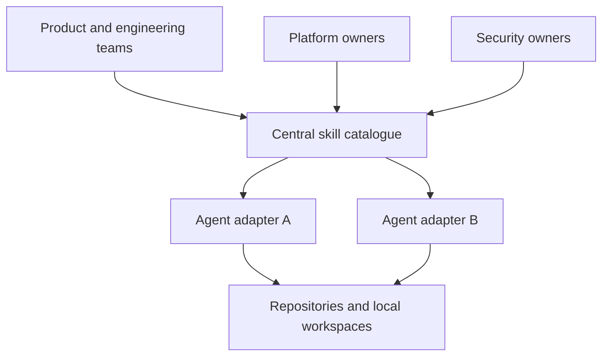
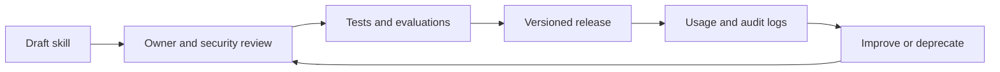
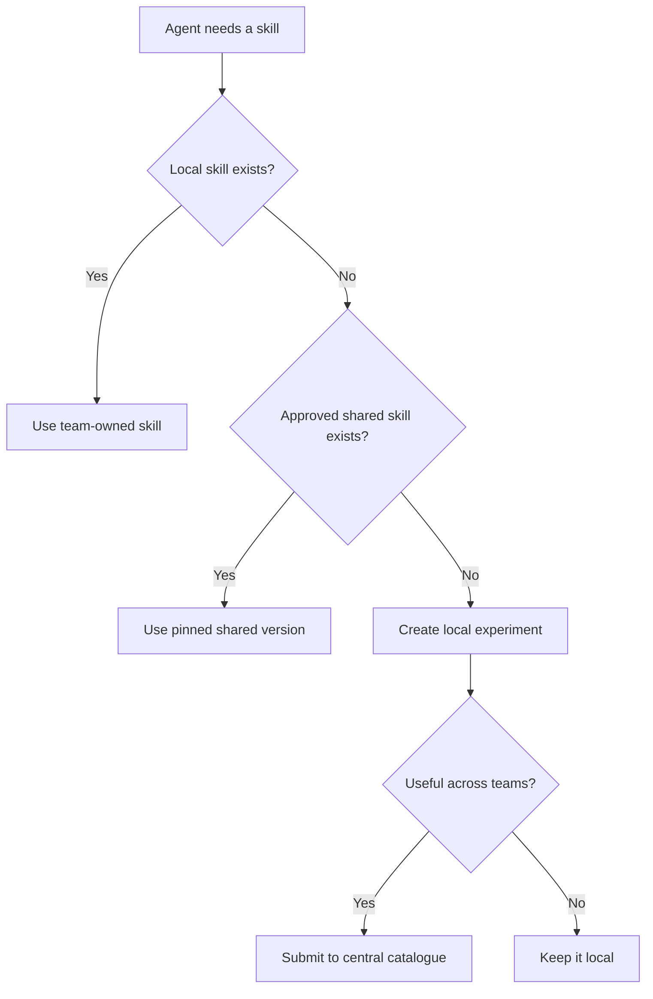

Once teams start using coding agents regularly, they tend to build the same things more than once.

One team creates a skill for reviewing pull requests. Another makes one for database migrations. Someone else builds a release workflow that does almost the same job, but with different prompts, scripts, and safety checks.

At first, that is fine. People are learning what works. But if every useful skill stays on one laptop or inside one repository, the organisation never really benefits from the work.

I would treat agent skills as shared internal tools: easy to discover and reuse, but still owned, reviewed, and controlled.

## Skills are not the same as instructions

It helps to separate skills from general agent instructions.

A repository instruction file tells an agent how to behave while working in that codebase. It might explain the test commands, architecture, or files that should not be edited.

A skill teaches an agent how to carry out a repeatable job. It can include a workflow, scripts, templates, examples, reference material, and checks. Reviewing an API change, creating a migration, preparing a release, or investigating an incident could each be a skill.

The distinction matters because instructions usually belong with the repository, while skills are often useful across many repositories and teams.

## Start with a central catalogue

I would keep approved skills in one central catalogue rather than copying folders around by hand.

The catalogue does not need to be a complicated platform. A Git repository is enough to begin with. Each skill can live in its own directory with its instructions, supporting files, owner, version, and a short description of when it should be used.

The catalogue should answer a few basic questions:

- What does this skill do?
- Who owns it?
- Which agents or environments support it?
- What tools and permissions does it need?
- How has it been tested?
- Which version should teams use?

That gives people somewhere to look before building another version of the same workflow.

*A central catalogue holds the shared skills; thin adapters make them available to different agents.*

## Centralise the controls, not every decision

A shared catalogue should not mean a central team has to write every skill.

Teams closest to the work should create and maintain the skills they understand. A database team can own migration skills. Security can own dependency and vulnerability checks. Platform teams can own deployment and infrastructure workflows.

The central layer should provide the common controls around those skills. I would standardise things like:

- Required metadata and named owners.
- Review and approval rules before a skill is shared widely.
- Permission levels for shell commands, network access, and external systems.
- A way to pin versions instead of always taking the latest change.
- Basic tests or evaluations for expected behaviour.
- A process for deprecating and removing old skills.

This keeps the boring but important parts consistent without forcing every team into the same workflow.

*The shared control loop for taking a skill from an experiment to a managed internal capability.*

## Make permissions visible

Skills can do much more than provide a prompt. Some will run scripts, call APIs, read production logs, or change infrastructure. That makes permissions part of the skill design, not an afterthought.

A skill should declare what it needs before it runs. A documentation skill might only need read access to the repository. A release skill may need permission to create tags and update a deployment system. Those should not be treated as equivalent.

I would use a small set of permission classes and require extra review for anything that can write to production systems, access sensitive data, or perform destructive actions. The default should be the least access the skill needs.

It should also be possible to see what happened after a skill ran: which version was used, which tools it called, and whether a person approved any sensitive step.

## Version skills like software

A centrally managed skill will change over time. Prompts improve, scripts are fixed, and company processes move on.

If every team automatically receives every update, one small change can break workflows across the organisation. Pinning versions gives teams a safer path. New versions can be tested with a few users, rolled out gradually, and rolled back if needed.

Not every change needs a formal release ceremony, but people should be able to tell what changed and whether the change affects behaviour or permissions.

Usage data can help here too. If nobody has used a skill for six months, it may be ready to retire. If everyone is overriding the same step, the shared version probably needs work.

## Leave room for local skills

Not every skill needs to become an organisation-wide standard.

A team should be able to keep local skills beside its code while they are experimental or only useful in that area. If one becomes broadly useful, it can move into the central catalogue after review.

I would make the lookup order simple: local skills can add context or override a shared default, while mandatory controls such as permission limits still apply everywhere.

This gives teams room to try things without turning the central catalogue into a dumping ground.

*Local skills remain the place for experiments; broadly useful workflows can be promoted after review.*

## Keep the agent-specific layer thin

Different agents package and discover skills in different ways. I would avoid making those formats the source of truth.

Keep the main skill content and metadata in a neutral structure, then use small adapters to install or expose it to each supported agent. When a tool changes, only the adapter should need attention. The workflow, ownership, and controls should stay the same.

The aim is not to collect as many skills as possible. It is to make the useful ones easy to find, safe to run, and clear to maintain.

Start with a repository, a small schema, named owners, and a review process. Add distribution tooling and reporting when the number of skills makes it worthwhile.

That is usually enough to turn a collection of personal agent tricks into something the whole organisation can rely on.
