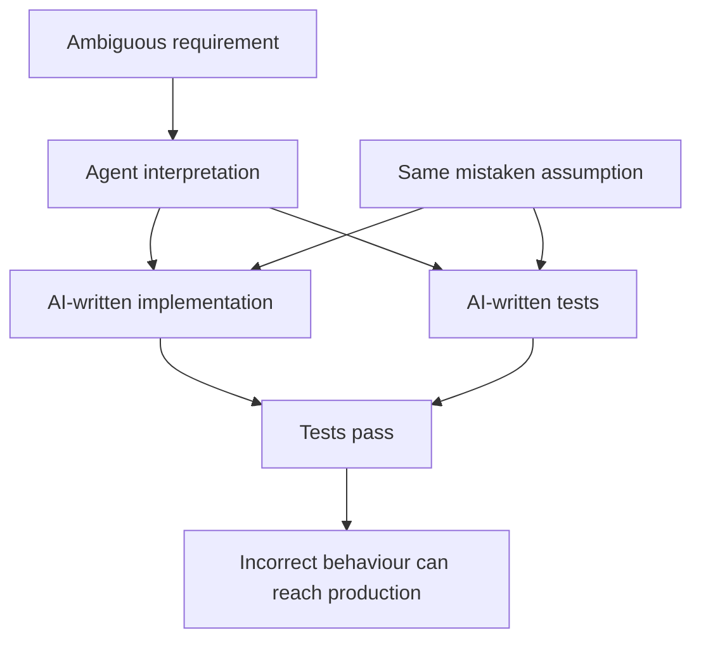
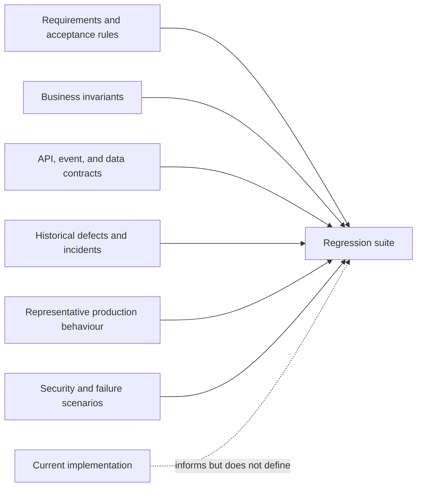
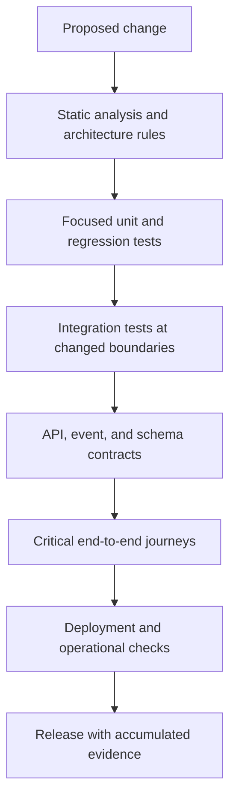
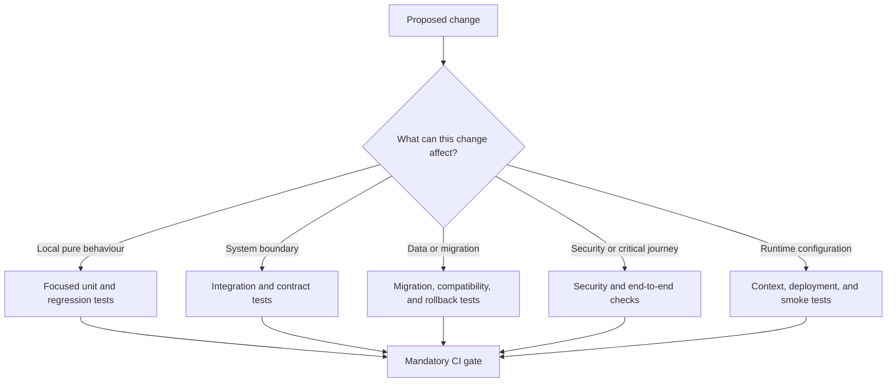

Coding agents can now implement a feature, generate its unit tests, add an integration test, and repair the failures without a person writing many of the individual lines. This can shorten feedback loops and make previously neglected test coverage affordable.

It also creates a new confidence problem.

If the same agent interprets the requirement, writes the implementation, and writes the tests, a green test suite may show that the code is internally consistent with the agent's interpretation. It does not necessarily show that the interpretation was correct.

The answer is not to distrust every AI-written test. A useful test should be judged by the behaviour it protects and the evidence it provides, not by whether a person or an agent typed it. But teams need independent sources of truth, durable regression coverage, realistic integration tests, and automation that runs regardless of what the author believes is sufficient.

As AI increases the speed and volume of change, regression and automation become more important, not less.

## AI can reproduce the same mistake twice

Suppose a requirement says that a customer can cancel an order "before fulfilment." An agent interprets that as any order that has not shipped. It implements the rule and generates unit tests for pending and shipped orders. Every test passes.

The product rule may actually prohibit cancellation once warehouse picking begins. The implementation and tests agree with each other, but both are wrong in the same way because they came from the same incomplete interpretation.

*Agreement between generated code and generated tests is not independent evidence that the requirement was understood correctly.*

This failure mode is not unique to AI. Developers have always written tests that confirm their own assumptions. AI makes it easier to produce a larger, more polished implementation and test suite from the same assumption before anybody else examines it.

That means test volume can create false confidence. Twenty generated examples derived from one misunderstanding are still one misunderstanding.

Independent evidence must come from somewhere outside the implementation loop: an explicit acceptance rule, a business invariant, an API contract, a historical incident, a production example, or a reviewer who understands the domain.

## Regression tests preserve what the system has learned

A mature regression suite is more than a collection of checks. It is accumulated organisational memory.

It records behaviours that customers depend on, edge cases discovered in production, contracts agreed with other systems, security boundaries, data assumptions, and failures the team has paid to understand. An agent arriving at the repository may know none of that history. The regression suite makes part of it executable.

This matters because agents are often optimised for the requested change. They can make a local implementation coherent while missing behaviour elsewhere that was not present in the prompt or immediate context.

A reliable regression test constrains that local optimisation. It says that although this change is new, these existing properties must remain true.

Useful regression coverage can be derived from several independent sources:

*The implementation is one input to test design, not the sole source of expected behaviour.*

Every significant production defect should prompt a question: what automated check would have detected this before release? The answer may be a unit test, but it may instead be a contract test, migration test, end-to-end scenario, static rule, or deployment check.

Adding that evidence to the regression suite prevents a future developer or agent from having to rediscover the same failure.

## Unit tests remain necessary but insufficient

AI is particularly effective at generating unit tests. It can identify branches, construct fixtures, create parameterised examples, and produce boundary cases quickly. That is valuable when the tests protect meaningful behaviour.

But generated unit tests often follow the shape of the implementation too closely. They may mock every collaborator, assert internal calls, reproduce constants from the production code, or confirm the return value of a method without checking the business consequence.

Such tests can pass while the system fails at its boundaries.

An order service may work with a mocked repository while its database mapping drops a field. A controller test may pass while JSON serialization uses the wrong property name. A publisher may invoke a mocked client while the emitted event violates its schema. A permission check may work in isolation while the deployed route bypasses it through different middleware.

Unit tests answer focused questions well:

- Does this domain rule handle the important states?
- Does this calculation preserve its invariants?
- Does this use case make the expected decision for each result?
- Does this parser reject malformed input?

They do not prove that independently developed components, framework configuration, infrastructure, and external contracts work together.

## Integration tests expose boundary mistakes

Integration tests become particularly important when AI can generate convincing code on both sides of a boundary.

If an agent changes a persistence record and its mapper together, unit tests may confirm that the two agree. A database-backed test can reveal that the migration, column type, constraint, query, and transaction behaviour do not. If an agent changes an event producer and a mocked consumer contract together, a schema or consumer-driven contract test can provide a boundary neither implementation controls alone.

The most valuable integration tests target places where local correctness is not enough:

- Database schemas, mappings, migrations, constraints, and transactions.
- HTTP serialization, validation, authentication, and error responses.
- Event schemas, ordering, idempotency, and retry behaviour.
- Dependency injection, configuration, feature flags, and runtime profiles.
- External service contracts, timeouts, and degraded behaviour.
- Cache, queue, filesystem, and infrastructure interactions.

These tests should use realistic components where the risk justifies it. Mocking the database driver does not validate a database migration. Replacing authentication middleware with a test stub does not prove that authorization is correctly wired.

The goal is not to turn every check into a slow end-to-end test. It is to place evidence at the boundary where a mistake can occur.

## Build a layered safety net

No single test type provides enough confidence for every change. An effective automated safety net uses layers with different costs and purposes.

*Fast checks support iteration; broader checks establish confidence across boundaries and runtime behaviour.*

Static analysis can catch type errors, unsafe patterns, dependency violations, and known security problems cheaply. Unit tests provide fast feedback around business behaviour. Integration and contract tests exercise boundaries. A small number of end-to-end journeys confirm that critical paths are assembled correctly. Deployment checks verify the environment in which the software actually runs.

The layers should overlap where failure would be expensive, but duplication alone is not the objective. Each layer should answer a question that a narrower layer cannot answer reliably.

## Automation must be independent of the author

An agent should run focused tests while it works. It should inspect failures, add missing cases, and expand validation based on the change. But the final decision about which checks are mandatory should not belong solely to the agent that made the change.

The agent has incomplete context and an incentive to complete the task. It may select the nearest tests, decide that an unrelated failure is irrelevant, or overlook a suite whose name does not reveal its connection to the changed code.

Continuous integration provides an independent enforcement point. Required checks run from a known configuration against the submitted change, regardless of whether the author is a person or an agent.

This is where automation provides more than convenience. It turns engineering expectations into repeatable controls:

- Every change is built from a clean environment.
- Mandatory tests cannot be skipped by omission.
- Architecture and policy checks run consistently.
- Test results are attached to the exact revision under review.
- Failures block promotion until they are resolved or explicitly governed.
- Release and rollback procedures follow the same tested path.

The pipeline should also protect the tests themselves. Reviews and ownership rules can require specialist approval for changes to security checks, contract fixtures, critical journeys, or CI configuration. Otherwise an implementation can be made green by weakening the evidence intended to constrain it.

## Let change risk determine the automation

Running every possible test for every edit can make feedback too slow to be useful. Running only the tests an agent chooses can miss important consequences. A practical system uses change risk to determine the required evidence.

*Test selection should follow the potential impact of the change, not the apparent size of its diff.*

Some of this selection can be encoded directly. Changes to a schema directory can trigger migration and compatibility tests. Changes to authorization packages can trigger security scenarios. Dependency rules can map components to their integration suites. Monorepo build tools can calculate affected projects.

The mapping should be conservative and observable. If dynamic test selection excludes a suite, the team should be able to understand why. Critical checks should remain mandatory when impact cannot be determined confidently.

AI can help improve this system by analysing diffs, identifying affected boundaries, and proposing additional tests. It should augment the deterministic rules rather than silently replace them.

## Coverage is not confidence

AI can increase code coverage quickly. That can be useful because unexecuted code deserves attention, but a higher percentage does not necessarily mean stronger regression protection.

A test can execute every line without asserting the important outcome. It can duplicate the implementation's calculation, lock in an accidental detail, or avoid the boundary where the real failure occurs. Coverage measures what ran, not whether the expected behaviour came from an independent source or whether the assertions would detect a meaningful defect.

Teams should inspect the quality of the evidence:

- Would the test fail if the business rule were reversed?
- Does it include failure paths and boundary conditions?
- Is the expected result derived independently of the implementation?
- Does it protect a stable behaviour rather than an internal arrangement?
- Does the test run at the layer where the relevant failure can occur?
- Has the team seen the test fail for the defect it claims to prevent?

Mutation testing can help evaluate whether unit-test assertions detect behavioural changes. Contract testing can reveal incompatible boundaries. Fault injection can exercise retries and degraded dependencies. None should become another number to optimise without context, but each can test the strength of the safety net more directly than line coverage alone.

## Review tests as production assets

When agents generate tests cheaply, teams may be tempted to review them less carefully than production code. The opposite is more appropriate for tests that define important behaviour.

A weak production implementation is constrained by a strong test. A weak test can permit many incorrect implementations while continuing to report success.

Reviewers should look for shared assumptions between the code and tests, assertions copied from implementation details, excessive mocking, omitted failure paths, and fixtures that make the scenario unrealistically easy. They should ask where the expected behaviour came from and which regression the test would catch.

Generated tests should also remain maintainable. Thousands of repetitive examples can slow pipelines and obscure the handful of scenarios that express important rules. AI makes test generation cheap, but the team still owns the cost of running, understanding, and repairing the suite.

The objective is not the largest suite. It is the smallest reliable body of evidence that protects the behaviours and boundaries the organisation cares about.

## A practical operating model

Teams adopting coding agents can strengthen regression and automation without redesigning their entire test strategy at once.

First, make the existing pipeline mandatory for AI-authored changes. An agent should not create a lower standard of evidence than a human author.

Second, turn important defects into durable regression checks at the layer where they escaped. Record the incident or requirement that gives each non-obvious test its authority.

Third, identify critical system boundaries and ensure they have realistic integration or contract coverage. Prioritise data, authorization, payments, events, and irreversible operations.

Fourth, separate test expectations from implementation prompts where practical. Give the agent explicit acceptance examples, contracts, invariants, or historical cases rather than asking it to infer all tests from the code it just wrote.

Fifth, encode risk-based test selection in CI. Let agents propose extra checks, but make baseline requirements deterministic and visible.

Sixth, measure the complete result. Watch escaped defects, rollback rates, flaky tests, review time, cycle time, and rework. A faster green build is valuable only if it supports safer and faster delivery.

Finally, periodically test the tests. Review whether critical checks can detect realistic mutations, whether integration environments still resemble production, and whether slow or flaky suites are being ignored.

## Automation turns speed into confidence

AI-written unit and integration tests can be excellent. They can broaden coverage, shorten feedback, and make it economical to preserve more edge cases than teams could maintain before. Their authorship is not the problem.

The problem is treating tests generated from the same context as the implementation as complete, independent proof.

Regression suites provide memory beyond the current task. Integration tests provide evidence beyond a local component. Contracts provide expectations beyond one side of a boundary. CI provides enforcement beyond the judgement of the author. Operational checks provide feedback beyond the build environment.

Together, those layers turn rapid code generation into controlled delivery.

In AI-driven development, the ability to produce a plausible change is becoming common. The durable advantage is the ability to establish, repeatedly and automatically, that the change is correct, compatible, and safe to release.
