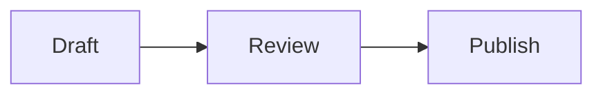

# Deployment and Content Management

This guide covers deploying the site to a GitHub user Pages repository and managing articles with Pages CMS.

## 1. Create the GitHub repository

Create a public repository named exactly:

```text
USERNAME.github.io
```

Replace `USERNAME` with your GitHub username. A user Pages repository is published at `https://USERNAME.github.io`.

Push this project to the repository's `main` branch. If the remote is not configured yet:

```bash
git remote add origin git@github.com:USERNAME/USERNAME.github.io.git
git push -u origin main
```

If `origin` already exists, inspect it before changing anything:

```bash
git remote -v
```

## 2. Enable GitHub Pages

1. Open the repository on GitHub.
2. Open **Settings**.
3. Select **Pages** in the sidebar.
4. Under **Build and deployment**, set **Source** to **GitHub Actions**.

The workflow in `.github/workflows/deploy-pages.yml` runs whenever `main` changes. It builds the static site into `out` and deploys that directory to GitHub Pages.

Open the repository's **Actions** tab to monitor the first deployment. Once it succeeds, open `https://USERNAME.github.io`.

## 3. Configure public site values

The deployment automatically sets `NEXT_PUBLIC_SERVER_URL` to the GitHub user Pages URL.

To configure the optional contact and studio values:

1. Open **Settings** in the GitHub repository.
2. Select **Secrets and variables → Actions**.
3. Open the **Variables** tab.
4. Add the required repository variables.

| Variable | Purpose |
| --- | --- |
| `NEXT_PUBLIC_EMAIL` | Contact email and email links |
| `NEXT_PUBLIC_LINKEDIN_URL` | LinkedIn profile URL |
| `NEXT_PUBLIC_STUDIO_URL` | Reserved external studio URL |
| `NEXT_PUBLIC_STUDIO_NAME` | Studio name; defaults to Potatoheads |

These values are public and embedded in the generated site. Use repository variables, not secrets.

After changing a variable, run the deployment again from **Actions → Deploy GitHub Pages → Run workflow**.

## 4. Connect Pages CMS

1. Sign in at [Pages CMS](https://app.pagescms.org/) using GitHub.
2. Authorize access to the `USERNAME.github.io` repository if prompted.
3. Select the repository.
4. Select the `main` branch.
5. Open **Articles**.

Pages CMS reads `.pages.yml` from the repository and provides fields for article metadata and a Markdown rich-text editor.

## 5. Publish an article

1. Open **Articles** in Pages CMS.
2. Select an existing article or create a new one.
3. Enter the title, slug, excerpt, category, publish date, and reading time.
4. Write the article in the **Content** editor.
5. Turn off **Draft** when the article is ready to publish.
6. Save the article.

Saving commits a Markdown file under `content/articles`. That commit triggers the GitHub Pages workflow. The update becomes public after the workflow finishes, usually within a few minutes.

The slug must contain lowercase letters, numbers, and hyphens only, for example:

```text
building-reliable-software
```

The resulting URL is:

```text
https://USERNAME.github.io/writing/building-reliable-software/
```

## 6. Drafts and future dates

Articles are excluded from the generated site when:

- **Draft** is enabled.
- The publish date is in the future.

Pages CMS still commits drafts to GitHub. Do not put sensitive draft content in a public repository.

A future-dated article requires a build after its publish time. Run the workflow manually from the GitHub **Actions** tab when it should go live.

## 7. Images, code, and diagrams

Images uploaded through Pages CMS are stored under `public/media` and referenced from Markdown.

Use fenced blocks for code:

````markdown
```typescript
const message = 'Hello'
```
````

Use a `mermaid` fenced block for diagrams:

````markdown

````

The site renders both formats automatically.

## 8. Verify locally

Use Node 22 and install dependencies:

```bash
nvm use
npm install
cp .env.example .env
```

Run the development server:

```bash
npm run dev
```

Open `http://localhost:3001`.

Before pushing changes, run:

```bash
npm run lint
npm run typecheck
npm run build
```

A successful build writes the deployable static site to `out`.

## 9. Troubleshooting

### Pages CMS does not show Articles

Confirm `.pages.yml` exists on the selected branch and Pages CMS has permission to access the repository.

### A saved article is not live

Open the repository's **Actions** tab and inspect the latest **Deploy GitHub Pages** run. Also confirm **Draft** is disabled and the publish date is not in the future.

### The Pages URL returns 404

Confirm the repository is named `USERNAME.github.io`, the Pages source is **GitHub Actions**, and the deployment workflow completed successfully.

### Contact links are missing

Add the corresponding repository variables and run the deployment workflow again.
